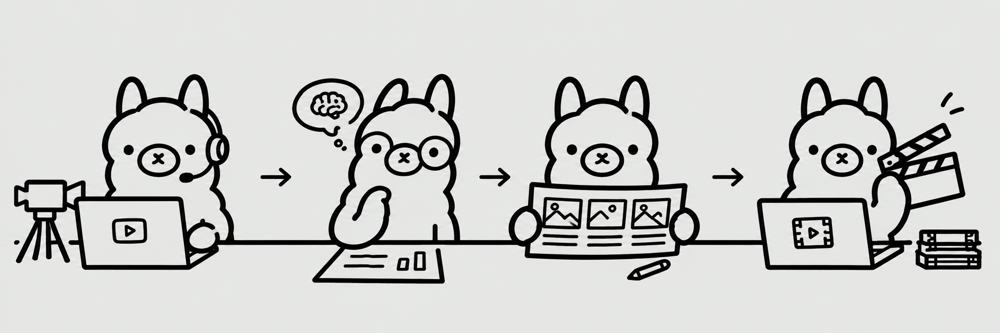

# llama-cut

An **Ollama-powered video editing pipeline** — a desktop GUI (PyQt6) that turns raw footage into a finished video with the help of local or cloud LLMs. Pick your source videos, let the models transcribe, analyse and storyboard them, then chat with an AI editing agent that builds an ffmpeg edit plan for you to review and run.



---

## What it does

`llama-cut` walks you through a 9-stage guided pipeline. Every stage persists its output to the working folder, so your project survives navigation and app restarts.

1. **Select Videos** — pick the source videos for the edit; the app generates thumbnails and probes each file's metadata.
2. **Context** — author Markdown context: one project-wide context plus per-video context. Transcription and frame-analysis slots fill in automatically in later stages.
3. **Transcription** — speech-to-text (faster-Whisper) on each selected video's audio, written into the per-video context.
4. **Frame Extraction** — ffmpeg extracts representative still frames at intelligent intervals from each video.
5. **Frame Analysis** — a vision model (`OLLAMA_VISION_MODEL`) describes every frame with a timestamp.
6. **Context Review** — everything gathered so far (context + transcription + frame analysis, with inline frame images) assembled into one editable document that the storyboard consumes.
7. **Storyboard** — an LLM (`OLLAMA_WORKFLOW_MODEL`) turns the assembled context + your creative brief into a scene-by-scene plan, with iterative refinement.
8. **Final Video Production** — a chat-driven edit-plan builder. The agent (with planning-only tools like `probe_video` and `inspect_clip`) works with you to build a plan of beats + typed ffmpeg commands. Review it as a visual beat strip, hit **Run Edit Plan**, and the executor runs the commands with weighted progress, checkpoint reuse, safe abort, and a failure→LLM-feedback loop that proposes fixes.
9. **Result** — playback the finished render with a summary report from the agent.

---

## How it works

- **Ollama models** power the creative/storyboard/editing agent and the frame vision analysis.
- **faster-whisper** provides local speech-to-text transcription (models cached under `models/`).
- **ffmpeg / ffprobe** do all actual media work — extraction, assembly, transitions, mixing, rendering, and validation.
- **PyQt6** provides the desktop UI, with background `QThread` workers keeping the interface responsive.

Everything generated lives under a hidden `.llama-cut/` directory in the working folder, including intermediate clips (kept as checkpoints so failed runs can be resumed) and the rendered video.

## Setup

### Requirements

- **Python 3.10+**
- **ffmpeg + ffprobe** on your `PATH`
- **Ollama** — either a local instance or a cloud account (the app supports `https://ollama.com` cloud with an API key)
- A vision model (e.g. `gemma4:31b`) and a workflow model (e.g. `deepseek-v4-flash:0731`)

### Install

```bash
# 1. Create and activate a virtual environment
python -m venv .venv
# Windows:
.venv\Scripts\activate
# macOS/Linux:
source .venv/bin/activate

# 2. Install dependencies
python -m pip install -r requirements.txt
```

> This project is not a package — it's installed and run from the source tree.

### Configure environment

Copy `.env.sample` to `.env` and fill it in:

```
OLLAMA_HOST=https://ollama.com        # or http://localhost:11434 for local
OLLAMA_API_KEY=cloud-api-key          # only needed for cloud
OLLAMA_VISION_MODEL=gemma4:31b        # vision model for frame analysis
OLLAMA_WORKFLOW_MODEL=deepseek-v4-flash:0731  # workflow/storyboard/editing model
```

Make sure the models you reference are pulled (for local Ollama: `ollama pull <model>`).

## Run

```bash
python main.py
```

1. Pick a **working folder** that contains your source videos.
2. Walk through the 9 stages. If you already have a partial project, `llama-cut` restores the state (the pipeline's outputs survive restarts).
3. In Stage 8, the chat input is pre-filled with a starting prompt — send it (or write your own) to kick off the edit-plan conversation, review the plan, and run it.

## Running the tests

```bash
python -m pytest tests
```

## Project layout

```
assets/                 fonts, ffmpeg reference, brand images
src/
  pages/                PyQt6 UI pages (one per stage) + chat/plan/debug widgets
  workers/              background QThread workers (thumbnail, probe, transcription, extract, analysis, LLM, execution)
  ffmpeg/               probing + frame-extraction strategy helpers
  state.py              PipelineState — the app's persistent working memory
  context.py / context_review.py   markdown context store + review assembly
  storyboard.py         storyboard generation + history
  video_production.py   edit-plan models, tool registry, prompts, persistence
  edit_plan_executor.py deterministic ffmpeg command builders + executor
main.py                 application entry point
```

## Philosophy (Stage 8, V2)

The editing agent is a **careful planner, not an autonomous executor** — goals are accuracy → determinism → inspectability → recoverability, with the human always reviewing the plan before ffmpeg runs. Failed commands halt execution and are fed back to the agent to propose a fix; completed clips become checkpoints that are reused on re-run.
